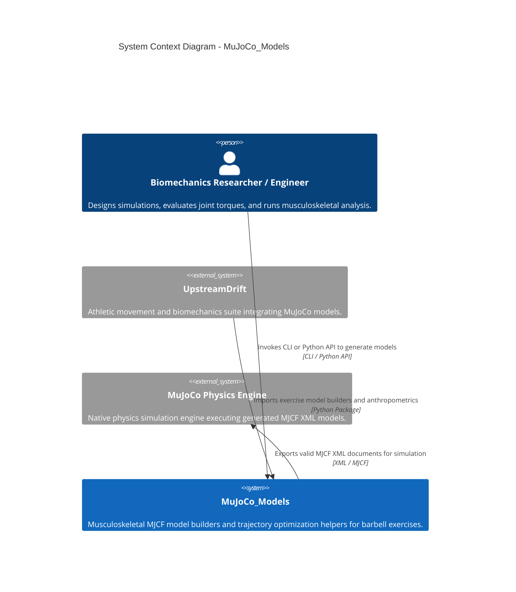
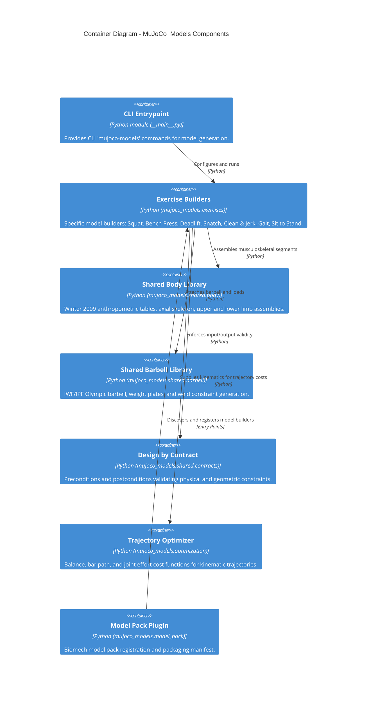

# Architecture Map: MuJoCo_Models

Architecture map and system boundaries for `MuJoCo_Models` following the Mermaid C4 contract.

## Context View (C4Context)

## Container View (C4Container)

## Feature Map

| Capability | Component | Interface | Evidence |
| --- | --- | --- | --- |
| Barbell Exercise MJCF Generation | `mujoco_models.exercises.*` | `build_*_model()`, `ExerciseModelBuilder` | `tests/unit/test_squat.py`, `tests/unit/test_bench_press.py`, `tests/unit/test_deadlift.py` |
| Musculoskeletal Full-Body Assembly | `mujoco_models.shared.body.*` | `create_full_body()`, `BodyModelSpec` | `tests/unit/test_body_model.py` |
| Olympic Barbell & Plates Model | `mujoco_models.shared.barbell.*` | `create_barbell()`, `BarbellSpec` | `tests/unit/test_barbell_model.py` |
| Design-by-Contract Validation | `mujoco_models.shared.contracts.*` | `@require_preconditions`, `@ensure_postconditions` | `tests/unit/test_contracts.py` |
| Biomechanical Model Pack Registration | `mujoco_models.model_pack` | `biomech.model_pack` entry point, `model_pack.yaml` | `tests/test_model_pack.py` |
| Kinematic & Balance Trajectory Optimization | `mujoco_models.optimization.*` | `compute_balance_cost()`, `compute_bar_path_cost()` | `tests/unit/test_trajectory_optimizer.py` |
| Architecture Map Contract Enforcement | `scripts/architecture_map_contract.py` | CLI `--path`, `validate_architecture_map()` | `tests/scripts/test_architecture_map_contract.py` |

## Architecture Change Log

| Date | Issue / PR | Description |
| --- | --- | --- |
| 2026-09-10 | #1605 | Adopt maintainable Mermaid C4 architecture-map contract with C4Context, C4Container, and Feature Map. |
